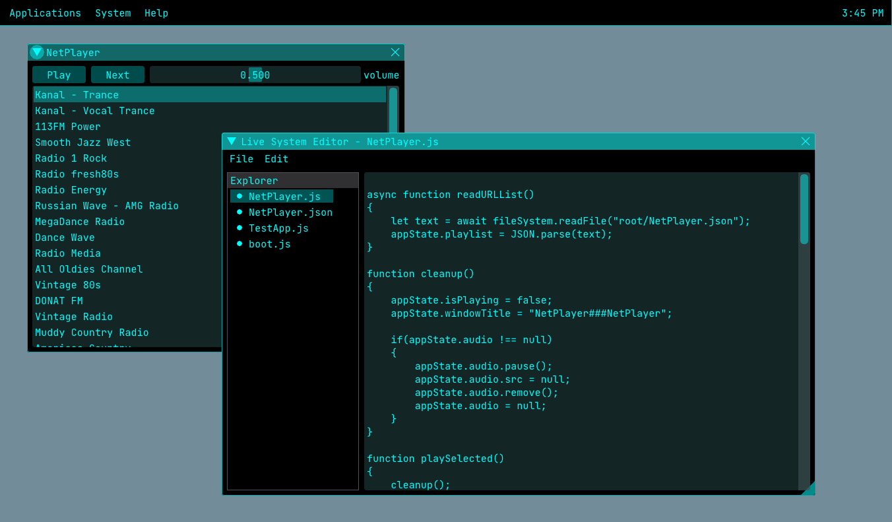

# ZyncOS

Programmable desktop like environment.

[Live demo here...](https://hasaranga.github.io/zyncos/index.html)



How to build: (requires node, typescript and parcel)
```
npm install
./compile.bat
```

Run using:
```
./dev-run.bat
```

